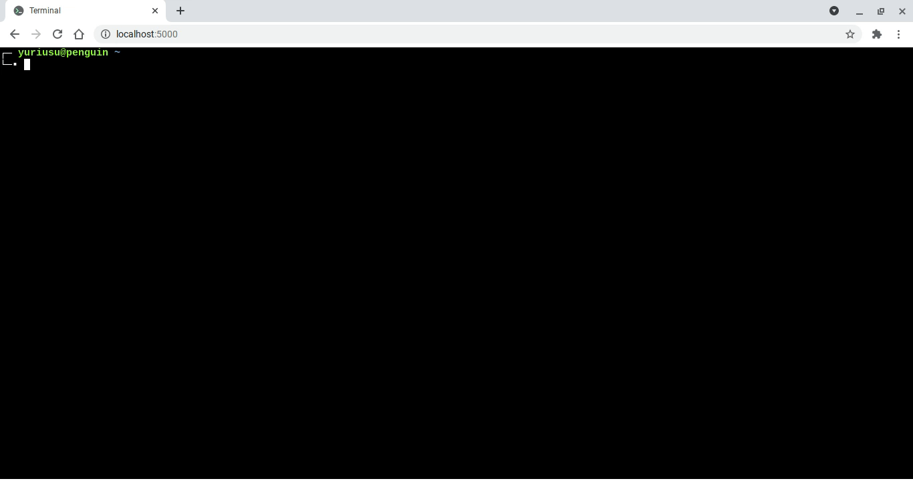

# Terminal

Cloud console using [`xterm.js`][1], [`node-pty`][2] and [`socket.io`][3].

Get started by initializing the local server ([`localhost:5000`][0]):

```console
npm install
npm start
```



## Copyright

Copyright &copy; 2022 Yuriuseu. See [LICENSE](./LICENSE) for details.

[0]: http://localhost:5000
[1]: https://github.com/xtermjs/xterm.js
[2]: https://github.com/microsoft/node-pty
[3]: https://github.com/socketio/socket.io
